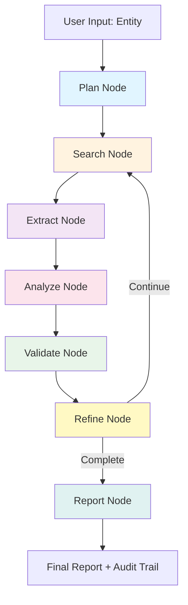

# Deep Research AI Agent

> **Autonomous intelligence gathering system capable of conducting comprehensive investigations to uncover hidden connections, potential risks, and strategic insights.**

[](https://www.python.org/downloads/)
[](https://github.com/langchain-ai/langgraph)
[](LICENSE)

---

## Overview

This Deep Research AI Agent is an autonomous system designed for **comprehensive due diligence and risk assessment** on individuals and entities. It employs multi-model AI orchestration, consecutive search strategies, and intelligent query refinement to discover non-obvious information that traditional search methods might miss.

### Key Capabilities

- **Multi-Model AI Integration:** Leverages multiple LLMs (OpenAI, Google Gemini, Anthropic Claude) with specialized roles
- **Consecutive Search Strategy:** Builds upon previous findings through iterative deepening
- **Dynamic Query Refinement:** Adapts search strategies based on discovered information
- **Risk Pattern Recognition:** Identifies red flags, inconsistencies, and concerning associations
- **Connection Mapping:** Traces relationships between entities, organizations, and events
- **Source Validation:** Implements confidence scoring and cross-referencing mechanisms
- **Comprehensive Reporting:** Generates detailed markdown reports with visualizations

---

## Architecture

### System Design



### LangGraph Workflow

The agent uses **LangGraph** for orchestration with the following nodes:

1. **Plan Node:** Creates initial research strategy using entity-type detection
2. **Search Node:** Executes queries via Tavily API with deduplication
3. **Extract Node:** Extracts facts, connections, and identifies related entities
4. **Analyze Node:** Detects risk patterns using secondary model for validation
5. **Validate Node:** Cross-references facts across sources with confidence scoring
6. **Refine Node:** Generates next queries based on findings and information gaps
7. **Report Node:** Synthesizes comprehensive markdown report

### Multi-Model Strategy

| Role | Model Assignment | Purpose |
|------|-----------------|---------|
| **Planner** | Primary Model | Initial strategy and query generation |
| **Researcher** | Primary Model | Information extraction |
| **Analyzer** | Secondary Model | Risk analysis (independent validation) |
| **Validator** | Secondary Model | Fact cross-checking |
| **Synthesizer** | Primary Model | Final report generation |

**Supported Models:**
- OpenAI: GPT-4 Turbo, GPT-4o
- Google: Gemini 2.0 Flash, Gemini Pro
- Anthropic: Claude Opus 4, Claude Sonnet

---

## Setup

### Prerequisites

- Python 3.9 or higher
- API keys for:
  - At least 2 LLM providers (OpenAI, Google, or Anthropic)
  - Tavily Search API

### Installation

1. **Clone the repository:**
   ```bash
   git clone <repository-url>
   cd deep_research_copy_test
   ```

2. **Install dependencies:**
   ```bash
   pip install -r requirements.txt
   ```

3. **Configure environment variables:**
   ```bash
   cp .env.example .env
   ```

4. **Edit `.env` with your API keys:**
   ```bash
   # Required: Choose at least 2 providers
   OPENAI_API_KEY=sk-...
   GOOGLE_API_KEY=...
   ANTHROPIC_API_KEY=...
   TAVILY_API_KEY=tvly-...

   # Model Configuration
   PRIMARY_MODEL=openai
   SECONDARY_MODEL=anthropic
   PRIMARY_MODEL_NAME=gpt-4-turbo-preview
   SECONDARY_MODEL_NAME=claude-opus-4

   # Agent Settings
   MAX_RESEARCH_DEPTH=5
   MAX_QUERIES_PER_ITERATION=3
   CONFIDENCE_THRESHOLD=0.7
   ```

### Verify Installation

```bash
python -m src.config
```

Expected output:
```
Configuration loaded successfully:
  Primary model: openai (gpt-4-turbo-preview)
  Secondary model: anthropic (claude-opus-4)
  Max research depth: 5
  Output directory: reports
```

---

## Usage

### Basic Usage

```bash
python -m src.main --entity "Sam Altman" --depth 5 --output-dir reports
```

### Command-Line Options

| Option | Description | Default |
|--------|-------------|---------|
| `--entity` | Name of entity to research (required) | - |
| `--entity-type` | Type: individual, organization, company | individual |
| `--depth` | Maximum research iterations | 5 |
| `--output-dir` | Directory for reports and logs | reports |
| `--config` | Path to custom .env file | .env |

### Example Commands

**Research a tech executive:**
```bash
python -m src.main --entity "Satya Nadella" --depth 5
```

**Research an organization:**
```bash
python -m src.main --entity "OpenAI" --entity-type organization --depth 4
```

**Custom output directory:**
```bash
python -m src.main --entity "Elon Musk" --depth 6 --output-dir ./investigations/elon_musk
```

---

## Test Cases

Three real public figures are used to demonstrate and evaluate the agent's capabilities. Each has verifiable online information with facts at multiple difficulty levels.

### Test Case 1: Sam Altman - Tech Executive
- **Profile:** CEO of OpenAI, former Y Combinator president
- **Level 1 Facts:** 3 basic biographical facts
- **Level 2 Facts:** 5 hidden connections (investments, family, controversies)
- **Key challenges:** Investment portfolio, brother Jack Altman, OpenAI board incident

### Test Case 2: Sheryl Sandberg - Tech Executive  
- **Profile:** Former Meta COO, author of Lean In
- **Level 1 Facts:** 3 career milestones
- **Level 2 Facts:** 5 hidden connections (personal tragedy, board positions, controversies)
- **Key challenges:** Late husband Dave Goldberg connection, Disney board, election criticism

### Test Case 3: Marc Andreessen - Tech Investor
- **Profile:** Co-founder of Andreessen Horowitz, Netscape creator
- **Level 1 Facts:** 3 tech history facts
- **Level 2 Facts:** 5 hidden connections (crypto investments, family, controversies)
- **Key challenges:** Meta board position, wife Laura Arrillaga-Andreessen, crypto advocacy

📄 **Full test cases:** See [`TEST_CASES.md`](TEST_CASES.md)

### Running Test Cases

```bash
# Test Case 1
python -m src.main --entity "Sam Altman" --depth 5 --output-dir test_results/sam_altman

# Test Case 2
python -m src.main --entity "Sheryl Sandberg" --depth 5 --output-dir test_results/sheryl_sandberg

# Test Case 3
python -m src.main --entity "Marc Andreessen" --depth 5 --output-dir test_results/marc_andreessen
```

**Evaluation Metrics:**
- Discovery rate: ≥70% of hidden facts
- Search efficiency: Match expected iteration count (±1)
- Risk detection: Identify inconsistencies and patterns
- Connection mapping: Discover ≥70% of expected connections

**Why Real People:**
These are real public figures with verifiable online information, allowing genuine validation of the agent's discovery capability against actual web sources.

---

## Evaluating Results

After running the agent, **evaluate its performance** by comparing discovered facts against expected facts.

### When to Evaluate

Run evaluation **after** the agent completes:

```bash
# Step 1: Run the agent
python -m src.main --entity "Sam Altman" --depth 5 --output-dir test_results/sam_altman

# Step 2: Evaluate discoveries
python evaluate_results.py "Sam Altman" test_results/sam_altman/*_state_*.json
```

### What It Shows

```
✅ Level 1: Y Combinator president 2014-2019
✅ Level 1: Loopt founder sold to Green Dot 2012
❌ Level 2: Helion Energy investment
✅ Level 2: Brother Jack Altman CEO Lattice

Discovery Rate: 75% (6/8)
Level 1: 100% (3/3)
Level 2: 60% (3/5)
```

### Metrics Provided

- **Overall Discovery Rate:** % of all expected facts found
- **Level 1 Performance:** Basic facts (should be 80%+)
- **Level 2 Performance:** Hidden connections (target 60%+)
- **Agent Statistics:** Iterations, queries, confidence scores

### Expected Facts

See [`evaluation_data.json`](evaluation_data.json) for the complete list of expected facts per test case.


## Output Files

After each research run, the agent generates:

### 1. Research Report (`<entity>_report_<timestamp>.md`)
Comprehensive markdown report including:
- Executive summary
- Facts discovered (categorized)
- Risk assessment by severity
- Connection diagrams (Mermaid)
- Source citations

### 2. Audit Trail (`<entity>_audit_<timestamp>.json`)
Complete JSON log of:
- Every node execution
- Queries executed
- Decisions made
- Intermediate results

### 3. Audit Summary (`<entity>_audit_summary_<timestamp>.md`)
Human-readable summary of the investigation process

### 4. State Snapshot (`<entity>_state_<timestamp>.json`)
Full state capture including:
- All facts, connections, risks
- Query history
- Entity tracking
- Metadata and statistics

---

## Features Deep Dive

### 1. Second-Order Entity Investigation

The agent automatically identifies and investigates **related entities** mentioned in findings:

```python
# Automatically tracked in state
entities_to_investigate: [
    {"name": "John Doe", "relationship": "business partner", "context": "..."},
    {"name": "Company X", "relationship": "investor", "context": "..."}
]
```

This enables discovery of hidden connections through family members, business associates, and affiliated organizations.

### 2. Confidence Scoring

Facts are validated across sources with confidence scores:

| Confidence | Criteria |
|------------|----------|
| 0.9-1.0 | 3+ high-quality sources |
| 0.7-0.9 | 2+ sources or 1 high-quality source |
| 0.5-0.7 | Single medium-quality source |
| <0.5 | Low-quality or unverified |

**Source Quality Tiers:**
- **High:** .gov, .edu, Reuters, Bloomberg, WSJ, NYT
- **Medium:** TechCrunch, Forbes, Wired, CNBC
- **Low:** Other sources

### 3. Query Deduplication

Prevents redundant searches by tracking and normalizing queries:
```python
# Automatically skips duplicate queries
"Sam Altman OpenAI" == "sam altman openai"  # Normalized
```

### 4. Hybrid Content Retrieval

**Primary:** Tavily API with `raw_content` (AI-optimized search)  
**Fallback:** Web scraping for pages with insufficient Tavily content  
**Result:** Every search result has content for extraction

### 5. Dynamic Stopping Criteria

Research continues until:
- Max depth reached, OR
- Confidence threshold met, OR
- No new queries generated, OR
- No information gaps remain

---

## Prompt Engineering

The agent uses **advanced prompt engineering** techniques optimized for intelligence gathering.

📄 **Detailed documentation:** See [`PROMPT_ENGINEERING.md`](PROMPT_ENGINEERING.md)

### Key Techniques

1. **Entity-Type Detection:** Hybrid heuristics + LLM classification
2. **Few-Shot Examples:** Context-specific examples based on entity type
3. **Chain-of-Thought:** Structured reasoning for query generation
4. **Source-Specific Strategies:** Tailored queries for different source types
5. **JSON Schema Enforcement:** Structured output parsing

### Example: Planner Prompt

```python
prompts.get_planner_prompt("Sam Altman")
# Returns optimized prompt with:
# - Entity type detection (tech_executive)
# - Few-shot examples for tech executives
# - Source-specific strategies
# - Search depth guidance
```

---

## Configuration

### Agent Parameters

Adjust in `.env`:

```bash
# Research Depth
MAX_RESEARCH_DEPTH=5          # 1-10 iterations
MAX_QUERIES_PER_ITERATION=3   # 1-10 queries per round
CONFIDENCE_THRESHOLD=0.7      # 0.0-1.0 (stop if reached)

# Rate Limiting
RATE_LIMIT_REQUESTS_PER_MINUTE=20
REQUEST_TIMEOUT_SECONDS=30

# Output
OUTPUT_DIR=reports
AUDIT_LOGS_ENABLED=true
```

### Model Selection

Choose models based on your needs:

**For Planning & Synthesis (Primary):**
- GPT-4 Turbo: Best reasoning
- Gemini 2.0 Flash: Fast and cost-effective
- Claude Opus: Excellent analysis

**For Validation (Secondary):**
- Different from primary for independent verification
- Claude Opus: Strong fact-checking
- GPT-4: Consistent validation

---

## Project Structure

```
deep_research_copy_test/
├── src/
│   ├── agent/
│   │   ├── graph.py          # LangGraph workflow
│   │   ├── nodes.py          # Node implementations
│   │   └── state.py          # State schema
│   ├── tools/
│   │   ├── search.py         # Tavily search tool
│   │   ├── scraper.py        # Web scraping fallback
│   │   └── validator.py      # Fact validation
│   ├── reporting/
│   │   ├── generator.py      # Report generation
│   │   └── audit.py          # Audit logging
│   ├── config.py             # Configuration management
│   ├── models.py             # Multi-model orchestration
│   ├── prompts.py            # Research prompts
│   └── main.py               # CLI entry point
├── reports/                  # Generated reports (gitignored)
├── test_results/             # Test case outputs
├── evaluation_data.json      # Test cases (expected facts)
├── TEST_CASES.md             # Test case documentation
├── PROMPT_ENGINEERING.md     # Prompt documentation
├── TEST_EXECUTION_GUIDE.md   # Testing guide
├── evaluate_results.py       # Evaluation script
├── requirements.txt          # Dependencies
├── .env.example              # Environment template
├── .gitignore                # Git ignore rules
└── README.md                 # This file
```

---


## Known Limitations

1. **Validation:** Currently uses keyword overlap; semantic similarity would be better
2. **Rate Limiting:** Configured but not actively enforced (relies on API limits)
3. **Caching:** No persistent cache between runs

---

## Future Enhancements

### Planned Improvements

- [ ] Semantic similarity for fact validation (embeddings)
- [ ] Persistent caching layer (Redis/SQLite)
- [ ] Interactive refinement mode
- [ ] Integration with knowledge graphs

### Production Considerations

- **Monitoring:** Add Prometheus metrics for query counts, latency, costs
- **Scalability:** Celery task queue for async processing
- **Cost optimization:** Token counting, model selection by task complexity
- **Privacy:** PII detection and redaction
- **Compliance:** GDPR considerations for data retention

---

## 📄 License

MIT License - See LICENSE file for details

---

## 💡 Credits

**Built for:** AI Engineer Technical Assessment  
**Technologies:** LangGraph, LangChain, OpenAI, Google Gemini, Anthropic Claude, Tavily  
**Author:** Suraj Sharma
**Date:** November 2025

---

## 📞 Support

For questions about this implementation:
- Review [`TEST_CASES.md`](TEST_CASES.md) for evaluation methodology
- Check [`PROMPT_ENGINEERING.md`](PROMPT_ENGINEERING.md) for prompt design decisions
- See audit logs for debugging failed searches

**Note:** This is a demonstration system. Use responsibly and ethically for legitimate due diligence purposes only.
